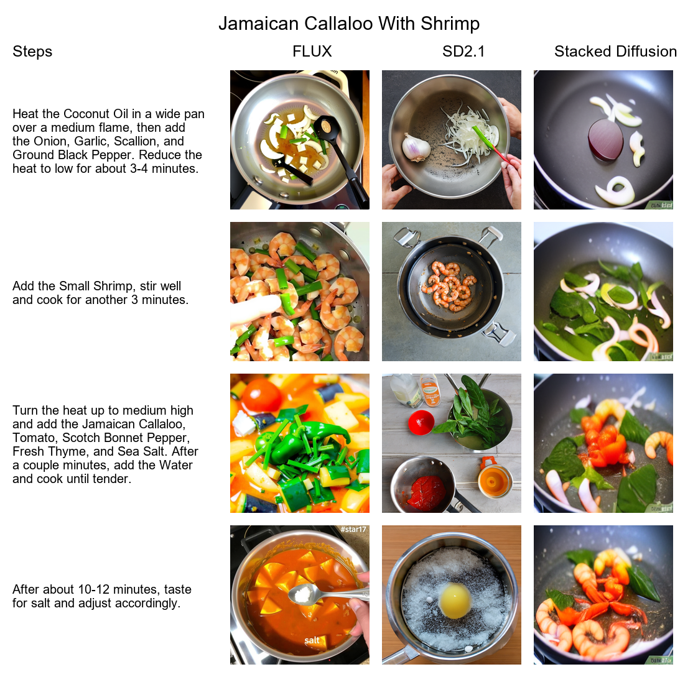

# Evaluating Hallucinations in Text-to-Image Models for Procedural Knowledge Generation

This project investigates the ability of state-of-the-art text-to-image models to generate step-by-step visual content for procedural tasks in the recipe domain. The goal is to identify hallucinations and compare the capabilities of different generative models.

## Objectives

- Evaluate the performance of text-to-image models in generating coherent visual sequences
- Measure:
  - Step-image alignment
  - Visual consistency between steps
- Compare these metrics across multiple models

## Dataset

- **Domain**: Cooking recipes  
- **Source**: [AllRecipes](https://www.allrecipes.com/)  
- **Details**:
  - 250 recipe tasks
  - Each task contains 4–6 natural-language steps
  - Based on the refined dataset from the paper 'Generating Coherent Sequences of Visual Illustrations for Real-World Manual Tasks', with additional modifications for model compatibility

## Text-to-Image Models

| Model Name             | Description |
|------------------------|-------------|
| **Stacked Diffusion**  | based on the paper 'Generating Illustrated Instructions with Stacked Diffusion Models' |
| **Stable Diffusion 2.1 (SD2.1)** | Open-source diffusion model used as a strong baseline |
| **Flux 1**             | Developed by **Black Forest Labs**, optimized for fast generation |

## Image Generation Pipeline

- For each of the 250 tasks, generate one image per step using each model.
- Non-stacked models generate images sequentially using a loop.
- Stacked Diffusion uses a hierarchical process to generate context-aware image sequences.

## Evaluation Metrics

| Metric        | Purpose                                      | Tool/Library                                                  |
|---------------|----------------------------------------------|---------------------------------------------------------------|
| **CLIPScore** | Text-image semantic alignment                | [CLIP](https://openai.com/research/clip)         |
| **DreamSim**  | Visual consistency between sequential steps  | [DreamSim](https://dreamsim.mit.edu/)                         |
| **VQA Score** | Image's ability to answer step-related questions | [ViLT](https://huggingface.co/dandelin/vilt-b32-finetuned-vqa) |

## Results

| Model               | DreamSim Score | CLIP Score | VQA Score |
|--------------------|----------------|------------|-----------|
| **Stacked Diffusion** | **0.47**        | 0.27       | 0.21      |
| **SD2.1**             | 0.41           | **0.31**    | **0.23**  |
| **Flux-Schnell**      | 0.44           | 0.30       | 0.22      |

- Stacked Diffusion excels at maintaining visual consistency across steps (DreamSim = 0.47), making it well-suited for producing coherent multi-step visuals.
- SD2.1 shows the strongest alignment with textual instructions, achieving the highest CLIPScore (0.31) and VQA Score (0.23), indicating it better grounds each image in the corresponding step description.
- Flux-Schnell offers a balanced performance, with moderate scores across all metrics, suggesting a trade-off between coherence and instruction alignment.

## References

- [_Generating Coherent Sequences of Visual Illustrations for Real-World Manual Tasks_](https://openreview.net/forum?id=H1lFqT4YwS)  
- [_Generating Illustrated Instructions with Stacked Diffusion Models_](https://arxiv.org/abs/2306.16431)  
- [_CLIP: Connecting Text and Images_](https://openai.com/research/clip)  
- [_DreamSim: Consistency Metrics for Visual Sequences_](https://dreamsim.mit.edu/)  
